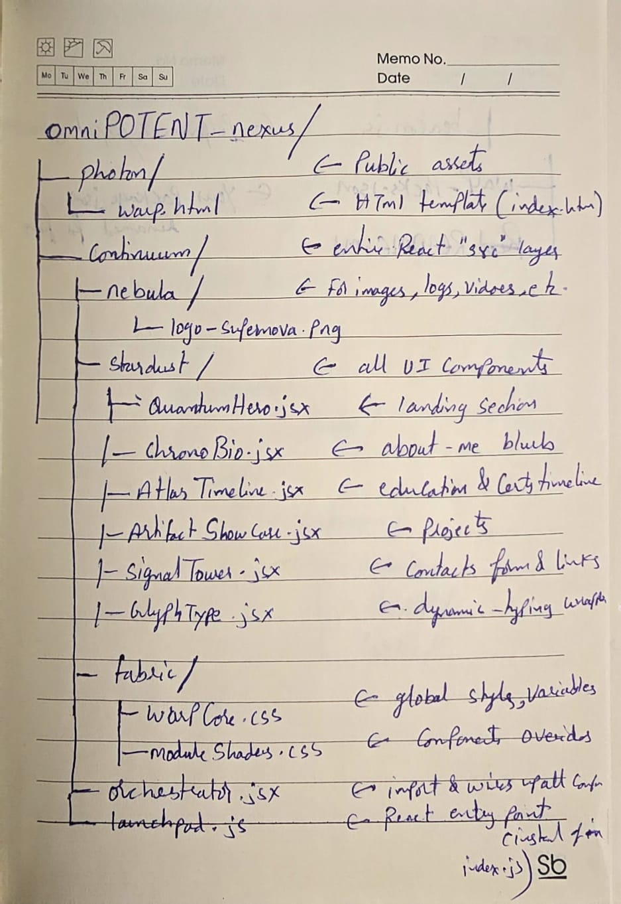
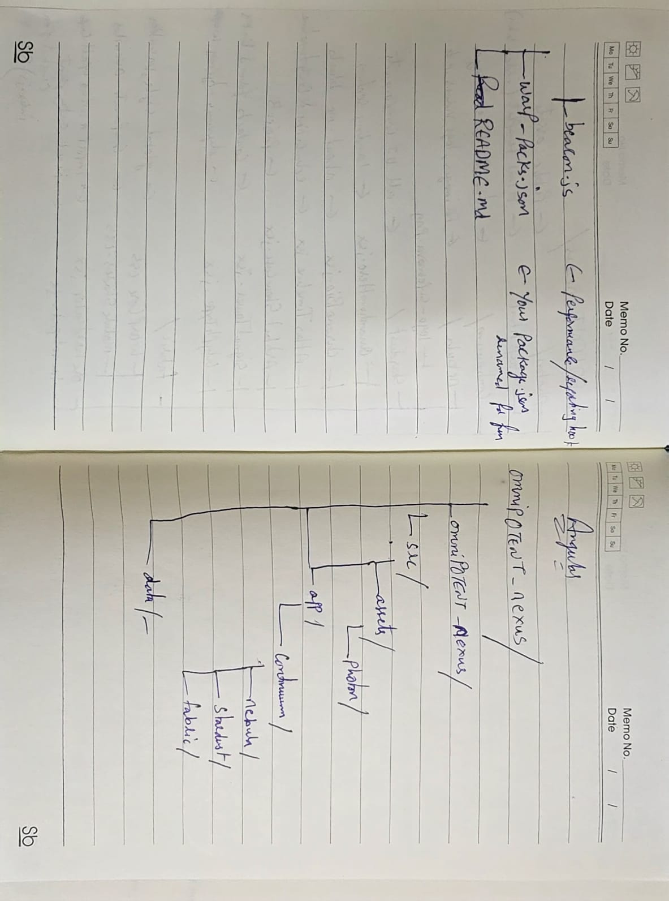

# OmniP0TENT Nexus

## 🌌 Overview
**OmniP0TENT Nexus** is an immersive, cosmos-themed interactive portfolio web application built to showcase personal projects, skills, and professional journey. Designed with a striking dark aesthetic and dynamic animations, the application provides a unique space-themed user experience.


## 🚀 Technologies Used
This project utilizes a modern technology stack to deliver high-performance rendering and sleek micro-interactions:
- **Angular (v20)**: The core framework providing a robust, component-based architecture, SSR compatibility, and seamless modularity.
- **Three.js & tsparticles**: Powers the intricate 3D elements and the dynamic starry particle background that grounds the visual identity.
- **GSAP & Framer Motion**: Orchestrates complex timeline animations and smooth component transitions.
- **Lottie-web & Anime.js**: Adds fine-tuned, lightweight vector interactions and physics-based micro-animations across the UI.
- **Typewriter-effect**: Brings a dynamic, retro-futuristic typing animation to the hero section for an engaging first impression.

## 🪐 Architecture & Cosmology (Directory Structure)
The project originally drew inspiration from React structures but evolved to employ a bespoke space-themed nomenclature mapped to standard Angular architecture. This creates an immersive development experience that reflects the frontend visual design:

- **`src/assets/photon/`**: Public assets and core visual elements (e.g., `Quantam-hero.jpeg`).
- **`src/app/continuum/`**: The main application source layer (time and space of the app).
  - **`nebula/`**: Stores static assets
  - **`stardust/`**:
    - `quantum-hero`:
    - `chrono-bio`:
    - `atlas-timeline`:
    - `artifact-showcase`: 
    - `signal-tower`:
  - **`fabric/`**: Global styles, CSS variables, and component-specific formatting overrides.

## 💻 Development Server
To launch :
```bash
https://omnipotent-nexus.netlify.app/
```
Navigate to `https://omnipotent-nexus.netlify.app/`. The application will automatically reload if you modify any source code.

## 📚 Additional Resources
*Initial Architecture Planning Notes and Concept Sketches:*

### Architecture Note 1


### Architecture Note 2



